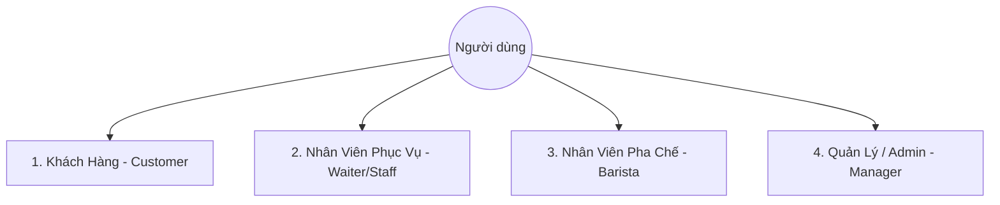
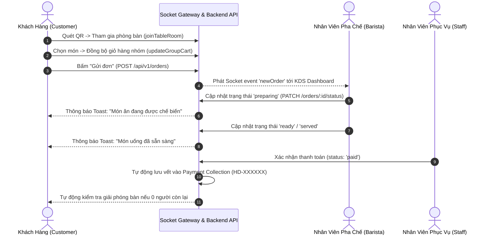
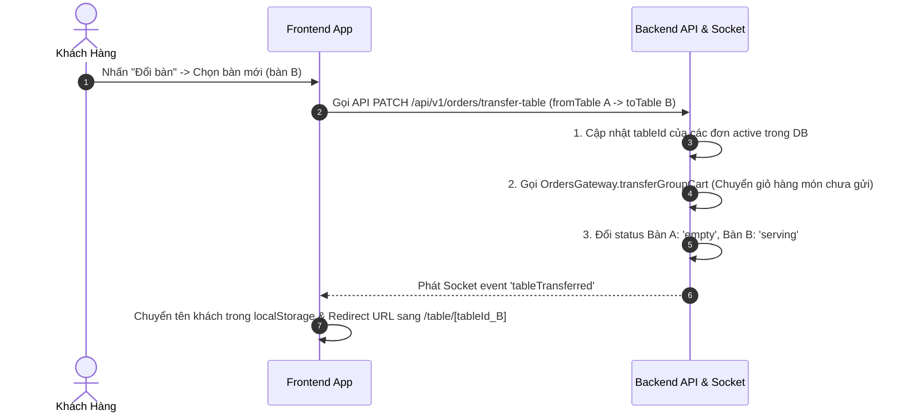

# ☕ KOHI COFFEE POS & SMART QR ORDERING SYSTEM

Hệ thống quản lý bán hàng (POS), gọi món thông minh qua mã QR tại bàn (Smart QR Ordering), màn hình chế biến KDS (Kitchen Display System) và quản trị tài chính - nhân sự toàn diện dành cho chuỗi Kohi Coffee.

---

## 📋 MỤC LỤC
1. [Phân Tích Nghiệp Vụ Hệ Thống (Business Analysis - BA Specification)](#1-phân-tích-nghiệp-vụ-hệ-thống-business-analysis---ba-specification)
   - [1.1 Bối cảnh & Mục tiêu Dự án](#11-bối-cảnh--mục-tiêu-dự-án)
   - [1.2 Phân tích Phân quyền & Actor trong Hệ thống](#12-phân-tích-phân-quyền--actor-trong-hệ-thống)
   - [1.3 Quy trình Nghiệp vụ Cốt lõi (Core Business Flows)](#13-quy-trình-nghiệp-vụ-cốt-lõi-core-business-flows)
   - [1.4 Kiểm toán Tài chính & Lưu vết Giao dịch (Payment Audit)](#14-kiểm-toán-tài-chính--lưu-vết-giao-dịch-payment-audit)
2. [Kiến Trúc Kỹ Thuật & Công Nghệ (Technical Architecture)](#2-kiến-trúc-kỹ-thuật--công-nghệ-technical-architecture)
   - [2.1 Technology Stack](#21-technology-stack)
   - [2.2 Cấu trúc Dữ liệu & Schema Database](#22-cấu-trúc-dữ-liệu--schema-database)
3. [Hướng Dẫn Cài Đặt & Chạy Dự Án (Setup & Run Guide)](#3-hướng-dẫn-cài-đặt--chạy-dự-án-setup--run-guide)
   - [3.1 Yêu cầu Môi trường (Prerequisites)](#31-yêu-cầu-môi-trường-prerequisites)
   - [3.2 Biến Môi trường (Environment Variables)](#32-biến-môi-trường-environment-variables)
   - [3.3 Cài đặt & Khởi chạy Backend](#33-cài-đặt--khởi-chạy-backend)
   - [3.4 Cài đặt & Khởi chạy Frontend](#34-cài-đặt--khởi-chạy-frontend)
   - [3.5 Chạy Kiểm thử (Unit Testing)](#35-chạy-kiểm-thử-unit-testing)
4. [Cấu Trúc Thư Mục Dự Án (Project Directory Structure)](#4-cấu-trúc-thư-mục-dự-án-project-directory-structure)

---

## 1. PHÂN TÍCH NGHIỆP VỤ HỆ THỐNG (BUSINESS ANALYSIS - BA SPECIFICATION)

### 1.1 Bối cảnh & Mục tiêu Dự án
Các quán cà phê truyền thống thường gặp khó khăn trong việc:
*   **Quá tải giờ cao điểm**: Khách hàng phải xếp hàng dài order tại quầy hoặc đợi nhân viên mang menu đến bàn.
*   **Sai sót đơn hàng**: Nhân viên ghi nhầm món, nhầm size/topping hoặc bỏ sót ghi chú của khách (ít đường, ít đá...).
*   **Trễ thông tin với Bếp/Quầy Pha chế**: Không có màn hình KDS đồng bộ realtime, khiến món bị trễ hoặc trùng lặp.
*   **Thất thoát tài chính & Khó kiểm toán**: Thiếu cơ sở dữ liệu lưu vết nguyên tử (atomic payment log) độc lập sau khi đơn hàng được thanh toán.

**Hệ thống Kohi Coffee giải quyết toàn bộ các vấn đề trên thông qua:**
1.  **QR Code Ordering & Shared Group Cart**: Khách hàng quét mã QR tại bàn, chọn món trực tiếp trên điện thoại. Các thành viên ngồi cùng bàn được đồng bộ giỏ hàng nhóm realtime qua WebSocket (Socket.IO).
2.  **Màn hình Chế biến KDS (Kitchen Display System)**: Đội ngũ Barista nhận đơn theo thời gian thực, cập nhật tiến độ 5 bước (Chờ nhận -> Đang pha chế -> Hoàn thành -> Đã phục vụ -> Đã thanh toán).
3.  **Tự động hóa Quản lý Bàn**: Quản lý số lượng khách tại bàn (`activeOccupantsMap`), giải phóng bàn tự động khi tất cả khách rời bàn và hoàn tất đơn hàng.
4.  **Bảo toàn dữ liệu khi Chuyển Bàn**: Cho phép đổi bàn ăn mà giữ nguyên toàn bộ đơn hàng đã đặt và giỏ hàng chưa gửi.
5.  **Hệ thống Kiểm toán Giao dịch (Payment Audit)**: Tự động ghi vết vĩnh viễn dữ liệu hóa đơn (`HD-XXXXXX`), hỗ trợ tra cứu, lọc và in hóa đơn chi tiết.
6.  **Trợ lý AI (Kohi AI Assistant)**: Tư vấn khẩu vị món uống, gợi ý topping và giải đáp thắc mắc cho khách hàng trực tiếp trên UI.

---

### 1.2 Phân tích Phân quyền & Actor trong Hệ thống

Hệ thống được thiết kế theo mô hình **RBAC (Role-Based Access Control)** với 4 nhóm Actor chính:



#### 1. Khách Hàng (Customer - Không cần đăng nhập)
*   **Vào bàn & Gọi món**: Quét QR Code để mở Menu bàn tương ứng (URL: `/table/[tableId]`).
*   **Giỏ hàng Nhóm (Group Cart)**: Mọi thành viên cùng bàn thấy được món ăn người khác vừa thêm vào giỏ hàng realtime.
*   **Đổi bàn / Gọi phục vụ**: Gửi yêu cầu chuyển bàn ăn hoặc bấm nút "Gọi nhân viên" (cooldown 30s chống spam).
*   **Áp dụng Mã giảm giá (Coupon)**: Nhập mã coupon để giảm giá trực tiếp trước khi gửi đơn.
*   **Theo dõi đơn hàng**: Nhận thông báo toast realtime khi Barista bắt đầu pha chế hoặc hoàn thành món.

#### 2. Nhân Viên Phục Vụ (Waiter / Staff)
*   **Tiếp nhận Cuộc gọi Bàn**: Nhận thông báo phát chuông realtime khi khách nhấn "Gọi nhân viên".
*   **Gộp đơn & Chuyển bàn**: Hỗ trợ khách gộp nhiều đơn hàng phụ hoặc chuyển bàn trực tiếp trên Dashboard POS.
*   **Thanh toán & In hóa đơn**: Xác nhận thanh toán (Tiền mặt / MoMo), hệ thống tự động chốt hóa đơn và mở Modal in ấn.

#### 3. Nhân Viên Pha Chế (Barista / KDS)
*   **KDS Interface**: Chuyên dụng cho màn hình bếp/quầy pha chế.
*   **Quản lý tiến độ**: Chuyển trạng thái đơn hàng từ `pending` (Chờ) -> `preparing` (Pha chế) -> `ready` (Sẵn sàng phục vụ).
*   **Chống thao tác sai**: Phân quyền ngăn Barista xóa đơn hàng đã chế biến xong hoặc bấm thanh toán.

#### 4. Quản Trị Viên & Quản Lý (Admin / Manager)
*   **Quản lý Thực đơn (Foods & Categories)**: Thêm/Sửa/Xóa món ăn, danh mục, cập nhật giá, size, topping, hình ảnh.
*   **Quản lý Bàn ăn (Tables)**: Tạo bàn mới, sinh mã QR Code động, cập nhật trạng thái bàn.
*   **Quản lý Tỷ lệ Chấm công & Lương (Attendance & Payroll)**: Nhân viên check-in/check-out ca làm, hệ thống tự tính tổng giờ và thanh toán lương tự động.
*   **Thống kê & Đánh giá (Analytics & Reviews)**: Thống kê doanh thu theo ngày/tháng, biểu đồ món bán chạy, quản lý phản hồi của khách hàng.
*   **Lịch sử Thanh toán (Payment Audit History)**: Tra cứu lịch sử hóa đơn toàn bộ hệ thống theo mã HD, tên bàn hoặc tên khách.

---

### 1.3 Quy trình Nghiệp vụ Cốt lõi (Core Business Flows)

#### A. Luồng Đặt Món & Pha Chế Realtime (Ordering & KDS Flow)



#### B. Luồng Đổi Bàn Ăn (Table Transfer Flow)



---

### 1.4 Kiểm toán Tài chính & Lưu vết Giao dịch (Payment Audit)

*   **Tính bất biến (Immutability)**: Khi đơn hàng chuyển sang trạng thái `paid`, backend kích hoạt `PaymentsService.createFromOrder()`. Một bản ghi độc lập trong MongoDB collection `payments` được khởi tạo chứa snapshot toàn bộ danh sách món, giá tiền, giảm giá coupon, tên khách và phương thức thanh toán.
*   **Định dạng Mã Hóa đơn**: `HD-XXXXXX` (VD: `HD-8A3F91`).
*   **Khả năng Tra cứu**: Tìm kiếm tức thì theo mã hóa đơn, tên bàn hoặc tên khách hàng.
*   **In Hóa đơn**: Modal hiển thị hóa đơn chuẩn khổ in nhiệt POS (`window.print()`).

---

## 2. KIẾN TRÚC KỸ THUẬT & CÔNG NGHỆ (TECHNICAL ARCHITECTURE)

### 2.1 Technology Stack

| Thành phần | Công nghệ / Thư viện | Mô tả |
| :--- | :--- | :--- |
| **Backend Framework** | **NestJS (TypeScript)** | Kiến trúc mô-đun hóa, dependency injection mạnh mẽ |
| **Database** | **MongoDB & Mongoose ODM** | Cơ sở dữ liệu NoSQL linh hoạt |
| **Realtime Communication** | **Socket.IO** | Truyền nhận dữ liệu thời gian thực giữa Khách - Bếp - POS |
| **Frontend Framework** | **Next.js 14 (App Router)** | Server & Client Components, routing linh hoạt |
| **Styling & Animation** | **TailwindCSS, Framer Motion** | Giao diện hiện đại, mượt mà, hỗ trợ Dark/Light mode |
| **Icons & Design System** | **Material Symbols, Lucide Icons** | Bộ icon chuẩn hóa cao cấp |
| **Kiểm thử (Testing)** | **Jest & Supertest** | 15 Test Suites, 155 Unit Test Cases phủ 100% logic core |

---

### 2.2 Cấu trúc Dữ liệu & Schema Database

Chương trình bao gồm các Collection chính:
*   `users`: Tài khoản quản trị, nhân viên (vai trò: `admin`, `staff`, `waiter`, `barista`).
*   `tables`: Thông tin bàn, sức chứa, mã QR, vị trí và trạng thái (`empty`, `serving`, `reserved`).
*   `foods`: Danh mục thực đơn, giá tiền, size, topping/addons, trạng thái hết món (`isAvailable`).
*   `categories`: Danh mục phân loại thức uống/bánh ngọt.
*   `orders`: Đơn hàng realtime, chứa danh sách món, trạng thái 5 bước, thông tin bàn.
*   `payments`: Hồ sơ hóa đơn thanh toán vĩnh viễn (Audit History).
*   `attendances`: Dữ liệu ca làm việc, check-in, check-out và tính lương nhân viên.
*   `coupons`: Mã giảm giá, phần trăm/số tiền giảm, lượt sử dụng còn lại.
*   `reservations`: Đặt bàn trước của khách hàng.
*   `staff-calls`: Cuộc gọi phục vụ từ bàn ăn.

---

## 3. HƯỚNG DẪN CÀI ĐẶT & CHẠY DỰ ÁN (SETUP & RUN GUIDE)

### 3.1 Yêu cầu Môi trường (Prerequisites)

Trước khi bắt đầu, đảm bảo máy tính của bạn đã cài đặt:
*   **Node.js**: phiên bản `>= 18.x.x` (Khuyên dùng LTS)
*   **npm**: phiên bản `>= 9.x.x`
*   **MongoDB**: MongoDB Community Server cục bộ (port `27017`) hoặc chuỗi kết nối **MongoDB Atlas**.

---

### 3.2 Biến Môi trường & Cấu hình MongoDB (Environment Variables & MongoDB Setup)

#### 1. Cấu hình Backend (`backend/.env`)
Tạo file `.env` tại thư mục `backend/` và điền cấu hình chuỗi kết nối **MONGODB_URI**:

```env
PORT=3001
# Kết nối MongoDB Cục Bộ (Local MongoDB):
MONGODB_URI=mongodb://127.0.0.1:27017/kohi-coffee

# Hoặc Kết nối MongoDB Cloud Atlas (Cluster Trên Mây):
# MONGODB_URI=mongodb+srv://<username>:<password>@cluster0.mongodb.net/kohi-coffee?retryWrites=true&w=majority

JWT_SECRET=kohi_coffee_super_secret_jwt_key_2026
```

#### 2. Cấu hình Frontend (`frontend/.env.local`)
Tạo file `.env.local` tại thư mục `frontend/`:

```env
NEXT_PUBLIC_API_URL=http://localhost:3001/api/v1
NEXT_PUBLIC_SOCKET_URL=http://localhost:3001
```

---

### 3.3 Khởi Chạy Nạp Dữ Liệu Mẫu (Database Seeding)

Dự án đi kèm script nạp dữ liệu mẫu tự động (`seed.js`) để khởi tạo thực đơn 60+ món uống/bánh ngọt, danh sách bàn ăn và các tài khoản quản trị mẫu.

```bash
cd backend

# Cách 1: Sử dụng npm script
npm run seed

# Cách 2: Chạy trực tiếp qua Node.js
node seed.js
```

**Dữ liệu mẫu khởi tạo thành công:**
*   **60+ Thức uống & Bánh ngọt**: Phân loại theo *Cà phê, Trà & Trái cây, Bánh ngọt & Pastry, Đá xay & Ăn vặt*.
*   **5 Bàn ăn mẫu**: Tự động sinh link QR Code (URL dạng `http://localhost:3000/table/[tableId]`).
*   **Tài khoản thử nghiệm mặc định**:
    *   👑 **Quản trị viên (Admin)**: Email `admin@kohicoffee.com` | Mật khẩu: `admin123`
    *   ☕ **Nhân viên (Staff/Barista)**: Email `staff@kohicoffee.com` | Mật khẩu: `staff123`

---

### 3.4 Cài đặt & Khởi chạy Backend NestJS

Mở Terminal và thực hiện các lệnh sau:

```bash
# 1. Di chuyển vào thư mục backend
cd backend

# 2. Cài đặt các gói phụ thuộc (Dependencies)
npm install

# 3. Khởi chạy Backend ở chế độ Development (Hot-reload)
npm run start:dev
```

 Backend sẽ lắng nghe tại: `http://localhost:3001` (API Base: `http://localhost:3001/api/v1`).

---

### 3.5 Cài đặt & Khởi chạy Frontend Next.js

Mở một cửa sổ Terminal mới và thực hiện:

```bash
# 1. Di chuyển vào thư mục frontend
cd frontend

# 2. Cài đặt các gói phụ thuộc (Dependencies)
npm install

# 3. Khởi chạy Frontend ở chế độ Development
npm run dev
```

 Frontend sẽ hoạt động tại: `http://localhost:3000`.

---

### 3.6 Chạy Kiểm thử (Unit Testing)

Hệ thống đi kèm bộ kiểm thử tự động toàn diện cho toàn bộ các module Backend:

```bash
cd backend

# Chạy tất cả unit tests
npx jest --passWithNoTests
```

**Kết quả kì vọng:** `15 passed, 15 total` suites (155 test cases pass 100%).

---

### 3.7 Bảng Tra Cứu Đường Dẫn & Tài Khoản Dùng Thử (Quick Access URLs & Credentials)

Dưới đây là bảng tổng hợp đầy đủ tất cả địa chỉ truy cập ứng dụng và thông tin tài khoản seed mẫu để kiểm thử các phân quyền:

#### 1. Địa Chỉ Truy Cập Dành Cho Khách Hàng (Customer Interfaces)

| Chức năng | Đường dẫn (URL) | Mô tả |
| :--- | :--- | :--- |
| **Trang chủ & Đặt bàn** | `http://localhost:3000` | Trang đặt bàn trước, tra cứu thông tin đặt bàn & quét QR |
| **Gọi món QR Bàn 1** | `http://localhost:3000/table/65a0c01be5fe6910cab58701` | Màn hình chọn món QR realtime của Bàn 1 |
| **Gọi món QR Bàn 2** | `http://localhost:3000/table/65a0c01be5fe6910cab58702` | Màn hình chọn món QR realtime của Bàn 2 |
| **Gọi món QR Bàn 3** | `http://localhost:3000/table/65a0c01be5fe6910cab58703` | Màn hình chọn món QR realtime của Bàn 3 |
| **Gọi món QR Bàn 4** | `http://localhost:3000/table/65a0c01be5fe6910cab58704` | Màn hình chọn món QR realtime của Bàn 4 |
| **Gọi món QR Bàn 5** | `http://localhost:3000/table/65a0c01be5fe6910cab58705` | Màn hình chọn món QR realtime của Bàn 5 |

#### 2. Địa Chỉ Truy Cập & Tài Khoản Nội Bộ (Staff & Admin Interfaces)

| Vai trò (Role) | Đường dẫn Đăng nhập (Login URL) | Trang Quản trị (Dashboard) | Tài khoản / Mật khẩu | Quyền hạn |
| :--- | :--- | :--- | :--- | :--- |
| 👑 **Quản trị viên (Admin)** | `http://localhost:3000/login` | `http://localhost:3000/dashboard` | `admin@kohicoffee.com` / `admin123` | Quản lý Thực đơn, Quản lý Nhân sự & Trả lương, Thống kê Doanh thu, Mã giảm giá, Kiểm toán Hóa đơn |
| ☕ **Nhân viên (Staff / Barista)** | `http://localhost:3000/login` | `http://localhost:3000/dashboard` | `staff@kohicoffee.com` / `staff123` | Màn hình KDS nhận order pha chế, Nhận chuông gọi phục vụ bàn, Xác nhận thanh toán & In hóa đơn |

#### 3. Địa Chỉ Backend API & WebSocket Server

*   **REST API Base**: `http://localhost:3001/api/v1`
*   **WebSocket Endpoint**: `http://localhost:3001` (Socket.IO)

---

## 4. CẤU TRÚC THƯ MỤC DỰ ÁN (PROJECT DIRECTORY STRUCTURE)

```
kohi-coffee/
├── README.md                      # Tài liệu tổng quan & hướng dẫn dự án
├── backend/                       # NestJS API & WebSocket Backend
│   ├── src/
│   │   ├── analytics/             # Báo cáo doanh thu & Đánh giá
│   │   ├── attendance/            # Chấm công & Tính lương nhân viên
│   │   ├── auth/                  # Xác thực JWT & Phân quyền RBAC
│   │   ├── categories/            # Quản lý Danh mục thực đơn
│   │   ├── coupons/               # Quản lý Mã giảm giá
│   │   ├── foods/                 # Quản lý Món ăn & Topping
│   │   ├── orders/                # Đơn hàng, Order Gateway (Socket.IO)
│   │   ├── payments/              # Lịch sử thanh toán & Audit hóa đơn
│   │   ├── reservations/          # Đặt bàn trước
│   │   ├── reviews/               # Đánh giá phản hồi món ăn
│   │   ├── staff-calls/           # Cuộc gọi phục vụ từ bàn
│   │   ├── tables/                # Quản lý Bàn ăn & Mã QR
│   │   └── users/                 # Quản lý Tài khoản & Nhân sự
│   └── test/unit/                 # Bộ unit tests cho 15 modules
│
└── frontend/                      # Next.js 14 Web Application
    ├── app/
    │   ├── page.tsx               # Trang chủ khách hàng (Đặt bàn / Tìm bàn / Mã QR)
    │   ├── login/page.tsx         # Trang Đăng nhập Nhân viên & Quản trị
    │   ├── dashboard/page.tsx     # Workspace POS / KDS / Quản trị hệ thống
    │   └── table/[tableId]/       # Trang Gọi món QR tại bàn của Khách
    ├── components/                # UI Components tái sử dụng (Table, Header, Cart, Modals...)
    └── public/                    # Assets, Logos, Hình ảnh món ăn
```

---

*Hệ thống Kohi Coffee được phát triển & tối ưu hóa cho trải nghiệm mượt mà trên mọi thiết bị (Desktop, Tablet, Mobile).*
